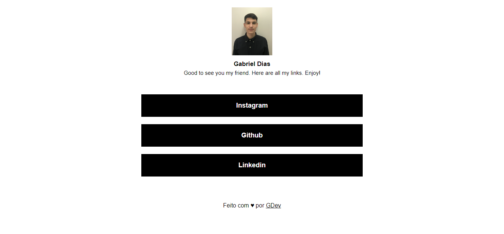

# Projeto Linkrain

## 💻 _linkrain_

Conecte seu TikTok, Instagram, Twitter, site, loja, vídeos, música, podcast, eventos e muito mais. Tudo vem junto em um link na página de destino bio.

## 💻 Projeto desenvolvido

## 💡 Info

O Linkrain é uma plataforma criada para ser uma opção que pode facilitar a sua vida se você precisa compartilhar muitos links, como todas as suas redes sociais, sem necessidade de listar todos ou em um espaço pequeno, como uma bio do Instagram.

## 🔨 Funcionalidades

-   Armazenar múltiplos links.
-   Pixel do facebook.
-   Painel administrativo para gerenciar e customizar seus links.

## 💻 Tecnologias/Pacotes utilizados

**Frontend**

-   PHP 8
-   Laravel
-   Sortablejs

## 👨‍💻 Autor

Gabriel Dias Catarin, desenvolvedor web | Bauru, São Paulo

[ LinkedIn](https://www.linkedin.com/in/gabriel-dias-260857207/)
&nbsp;
